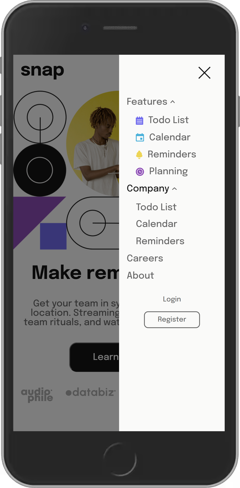

# Frontend Mentor Challenge - Intro section with dropdown navigation

The challenge was to build out an intro section with dropdown navigation and get it looking as close to the provided design as possible.

[Click here to see the result.]()

Tools I used: React, Redux Toolkit, SASS and Vite.

Here are some photos of the final product:

   
   

    

## What I Learned from this Project?

Besides the usual work of layout and design, in this project, I built a responsive hamburger menu from scratch using Redux Toolkit. It taught me the benefits of Redux Toolkit for state management in terms of streamlined state handling and improved code maintainability. Implementing responsive web design principles ensured that the menu adapts to different screen sizes.

In conclusion, I gained insights into centralized state management, modular code organization, and smooth data flow between components. This project enhanced my frontend development skills with Redux Toolkit and responsive design techniques.
